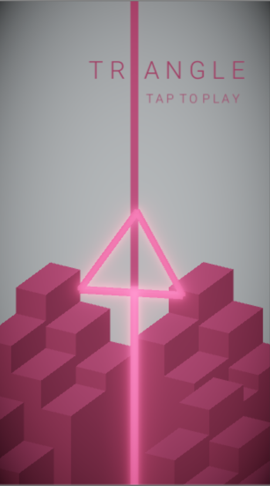

# Triangle

An original mobile hypercasual game created using Unity.

The basic idea is as follows: the player controls the triangle and follows the line, trying to avoid any contact with it. The line consists of many pieces of several different types: simple line, speed increasing/decreasing line, changing scale line and blinking line. The goal is to pass as many lines as you can.

* [Gameplay video](https://drive.google.com/open?id=17i6tL8yp3S4RdmxdpMRfH2SmE51SDFym)
* [Android build](https://drive.google.com/open?id=1MIvl8gL9Luc3veLFjSODTZLKl52XEn6Q)
